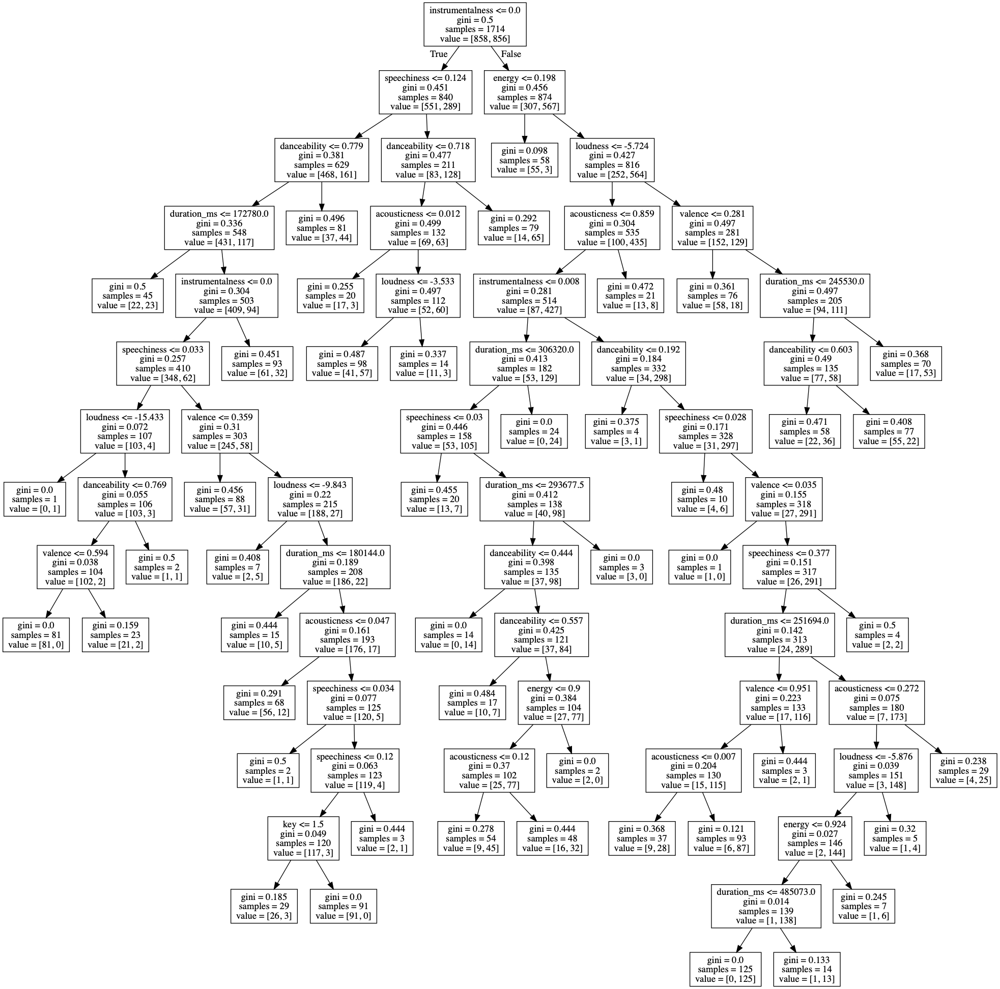
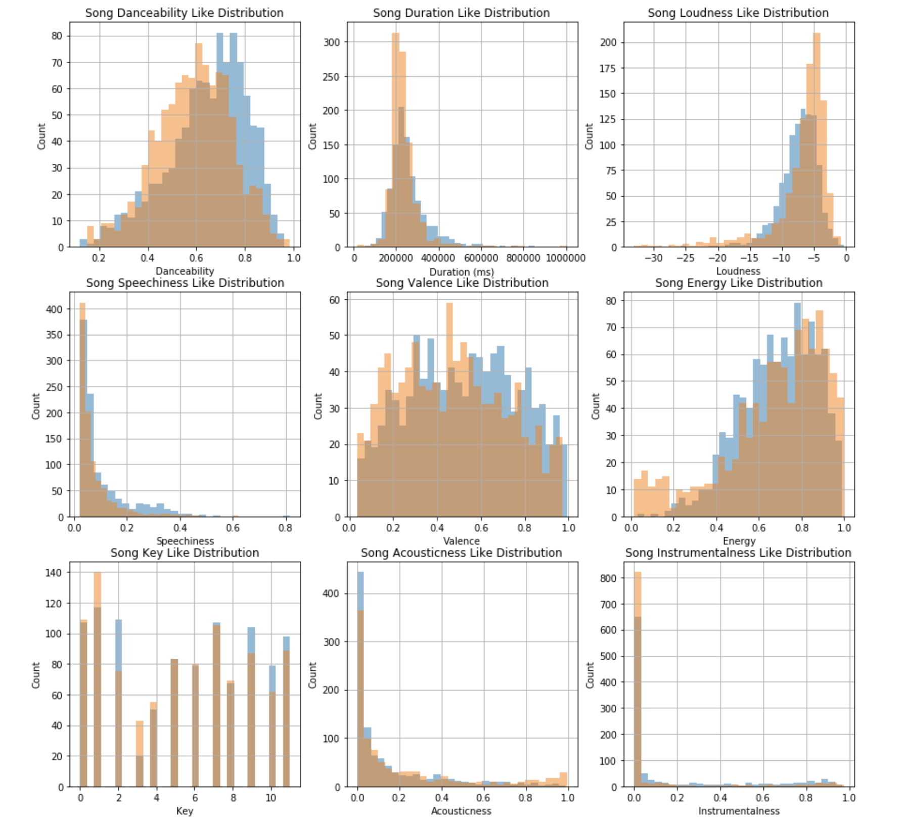

# Spotify EDA DecisionTreeClassifier

Constructed a Spotify decision tree classifier model with minimum split value of 100 to calculate the accuracy of affinity a user expresses towards a song from their Spotify data by using a like to dislike ratio comparison and specific attributes of each song such as valence, energy, instrumentalness, duration etc. This resulted in a 75.2% accuracy reading.

    
    

